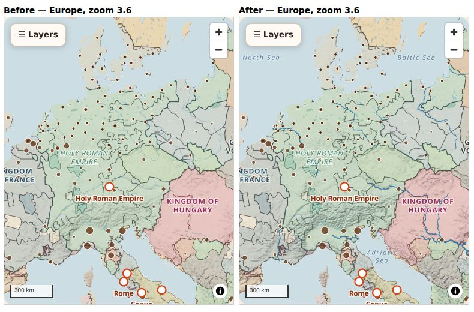
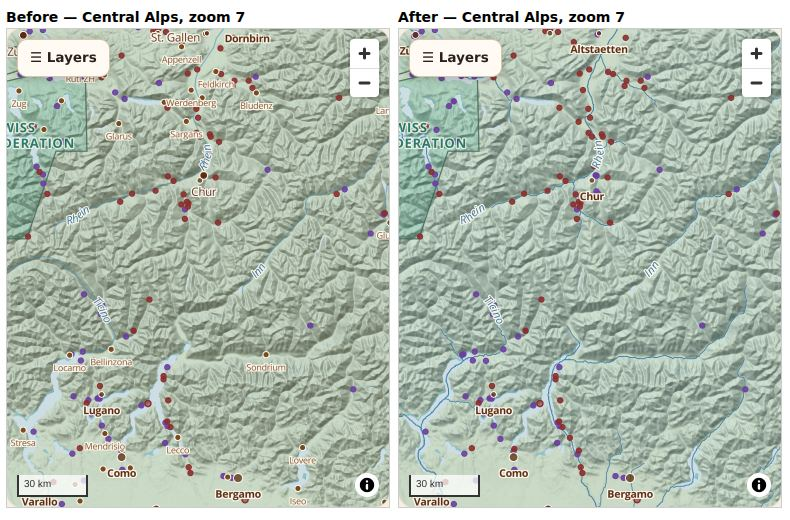
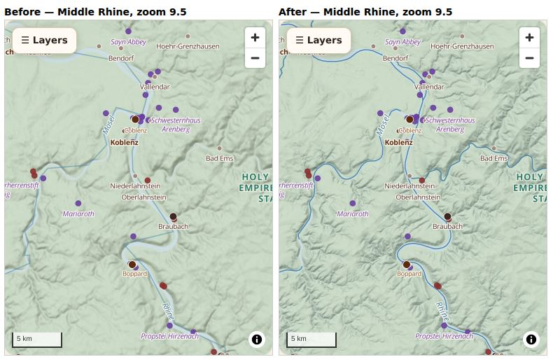

# Base map: what is under Shelf's historical layers, and what should be (1 October 2026)

This document is about the **geographic foundation** only: coast, water, relief, physical names and modern reference
places. It sets out what the base map is today and why it looks crude. It then compares the real data sources and
recommends an architecture for Europe that can be built, hosted on GitHub Pages and drawn on a phone. It does not
touch historical datasets, the temporal model or the historical layers.

Everything below about the current map was read from the code (`src/atlas/AtlasMap.tsx`, `src/atlas/catalog.ts`,
`scripts/atlas-build/build.py`) or measured. To measure the options, a prototype was built and compared with the
current base in the same views:

- `scripts/basemap-prototype/hydrorivers_tiles.py` builds the river tiles.
- `scripts/basemap-prototype/style-compare.html` draws both styles.

**Correction (same day).** The first version of this document compared the prototype with a hand-made copy of the
current style. That copy drew the relief above the sea, and the real app does not. So the claim that "the relief
muddies the sea" and the Europe and Aegean comparisons built on it were wrong, and they have been removed. All
before/after pictures are now screenshots of the real app (the build of `main` against this branch), at 412 px phone
width, with the default historical layers on, year 1300. Step 1 is in `docs/basemap/step1/`.



---

## A. The current base map

The base is put together in two places.

**1. `baseStyle()` in `src/atlas/AtlasMap.tsx`.** It is always present, under every layer:

| Layer | Source | What it is |
|---|---|---|
| `sea` | background | `#cddde4`. It becomes the land colour `#efe7d4` as soon as one OpenFreeMap tile has loaded (`detailedBase(true)`). |
| `land` | `public/atlas/ne-land.json` (918 KB GeoJSON) | Natural Earth **1:50m** land, simplified at 0.01° (≈1 km) in `build.py`. It is visible only while OpenFreeMap is unavailable. |
| `water-detail` | OpenFreeMap `planet` vector tiles, `water` layer | Ocean, lake and river polygons (OpenMapTiles schema). These come from Natural Earth up to z5 and from OSM water polygons from z6. This is the only one of OpenFreeMap's 16 layers that is used. |

**2. Physical layers in `src/atlas/catalog.ts`.** They are ordinary atlas layers in group `physical`:

| Layer | Source | Notes |
|---|---|---|
| `terrain` (on) | AWS `elevation-tiles-prod` Terrarium PNG, 256 px, maxzoom 12 | A hillshade at exaggeration 0.45 with warm brown shadows (`#5a4a3a`). It is drawn under the water, because `terrain` comes first in `DRAW_ORDER` and `sync()` moves `water-detail` above the political layers. |
| `rivers` (on) | `public/atlas/ne-rivers.json` (2.0 MB GeoJSON) | Natural Earth **10m** `rivers_lake_centerlines`, simplified at 0.005° (≈500 m). It is filtered by `scalerank` (≤5 at z<4, ≤7 at z<6, all ≤10 after). It has about 170 named features in Europe, and labels from z5. |
| `lakes` (on) | AWMC inland water | This is ancient-world (Barrington) data. It is not a modern base layer. |
| `coast-modern` (off) | `ne-land.json` | A dashed outline of the same 1:50m land. |
| `cities`, `towns`, `villages` | OpenHistoricalMap vector tiles | These are **dated** historical places. They are not reference labels. |

There are also some fixed settings:

- **Glyphs** come from `openhistoricalmap.org/map-styles/fonts` (OpenHistorical, Bold and Italic). There is no sprite.
- **Map options:** Web Mercator, `maxZoom: 15`, rotation off. OpenFreeMap tiles stop at z14 and are over-zoomed above that.
- **Outside services** are needed for the base: OpenFreeMap (water), AWS (relief), and openhistoricalmap.org (fonts and
  OHM places). None of them needs a key. All of them must be online.

## B. Why it looks poor (measured, not assumed)



1. **Almost no rivers.**
   - Natural Earth 10m is a 1:10 million dataset. At z7 in the Alps it draws three rivers (Rhein, Inn, Ticino) and nothing else.
   - The OpenMapTiles `waterway` layer, on the same OpenFreeMap tiles, has only named major rivers below z12 (5–13 per
     tile at z6–10). It is exact, but sparse, and it is stored in short pieces, too short on screen to carry a name
     until about z11. Shelf did not use it.
   - So between z5 and z10, where Shelf is used most, Europe has almost no river network. Tributaries, the Po system,
     the Seine–Marne–Oise and the Vistula basin are all missing.
2. **No physical or reference names at all.** The base has no sea, gulf, strait, lake, mountain or modern place
   label. OpenFreeMap carries `water_name`, `mountain_peak` and `place`, but Shelf does not use them. The only names on
   screen are historical ones, so a reader cannot find "where Lake Constance is" unless a historical layer happens to
   name it.
3. *(Withdrawn: the relief does not show through the sea in the real app. See the correction at the top.)*
4. **The relief is blurred and too warm.**
   - AWS Terrarium is a 256 px PNG from SRTM-era sources. At z7–10 it is over-zoomed and soft.
   - Its brown shadow on a beige land colour gives the whole map one muddy tone. The old-atlas look comes from a
     colour cast, not from structure.
5. **The fallback coast is crude.** If OpenFreeMap fails, the land shape is Natural Earth 1:50m simplified to about
   1 km. Fjords, the Venetian lagoon and the Wadden islands disappear.
6. **Today's water is shown for every date.** The water polygons are modern OSM, so several things show at any year:
   - Flevoland and the Noordoostpolder show as land in 1300.
   - The Zuiderzee does not exist.
   - Reservoirs such as Lac de Serre-Ponçon (1960) and the Rybinsk Reservoir (1941) show as if they were natural.
   - The Venetian lagoon includes Tronchetto and the modern port islands.

   Nothing on the map tells the reader that these are modern.
7. **Four live outside dependencies for one picture.** A slow OpenFreeMap response flips the background between
   sea and land (`detailedBase`). There is no offline base, and no control over the fonts.
8. **There is no hierarchy.** The base has no notion of "large river first, tributaries later" and no consistent label
   priority, so historical fills are the only strong graphic signal. That is why the political colours dominate. The
   problem is not that those colours are wrong.

## C. Sources considered, with how to get them

Status: "measured" means downloaded or fetched in this session. "Verified" means the access page was checked.

### Coast, sea and land

| Source | Scale and geometry | Licence | Access | Status |
|---|---|---|---|---|
| **OSM water / land polygons** (osmdata.openstreetmap.de) | Full detail (split, 864 MB / 885 MB). A simplified set (22.6 MB) for z0–8. Updated daily. | ODbL | Direct download: `water-polygons-split-4326.zip`, `simplified-water-polygons-split-3857.zip` | Measured (sizes) |
| **OpenFreeMap** planet tiles | OpenMapTiles schema. NE up to z5, then OSM. Max z14. | ODbL + OMT | Live, keyless (`tiles.openfreemap.org/planet`) | Used now; measured |
| **Protomaps** daily planet PMTiles | Protomaps schema, z0–15 | ODbL | `pmtiles extract https://build.protomaps.com/YYYYMMDD.pmtiles europe.pmtiles --bbox=-25,34,45,72 --maxzoom=N`. The planet is 138 GB. | Verified |
| **EuroGlobalMap** (1:1M) / **EuroRegionalMap** (1:250k), EuroGeographics | National mapping agencies' data, harmonised. Coast, hydrography, settlements and names. | Open (CC-BY 4.0 since 2023) | Registration at https://www.mapsforeurope.org/access-data. The S3 links returned 403 without it. | Verified, not downloaded |
| **GSHHG** | A global coast at 5 resolutions | LGPL | The NOAA URL returned 404 here. It is superseded by OSM for Europe. | Rejected |
| **Natural Earth** 10m / 50m | 1:10M, 1:50M | Public domain | naturalearthdata.com | Used now |

### Rivers, lakes and wetlands

| Source | What it has | Licence | Access | Status |
|---|---|---|---|---|
| **HydroRIVERS v1.0** (eu) | 938,544 segments with upstream area, discharge, Strahler order and main-stem ID. **No names.** Geometry is 15″ (≈500 m), derived from a DEM. | CC-BY 4.0 | `data.hydrosheds.org/file/HydroRIVERS/HydroRIVERS_v10_eu_shp.zip` (64.5 MB) | **Measured and prototyped** |
| **EU-Hydro** river network (Copernicus) | Pan-European rivers, canals, lakes, transitional and coastal water. Strahler order, names, minimum mapping unit 1 ha, from very-high-resolution imagery. | Copernicus open data (free) | A free Copernicus Land account: https://land.copernicus.eu/en/products/eu-hydro/eu-hydro-river-network-database | Verified; needs an account |
| **OSM waterways** (`waterway=river/canal`, `type=waterway` relations) | Named, exact geometry, up to date | ODbL | A Geofabrik Europe extract (~30 GB PBF) with `osmium tags-filter`, or the OpenFreeMap `waterway` layer at z≥11 | Verified |
| **HydroLAKES v1.0** | 1.4 M lakes of ≥10 ha. `Lake_type` 1 = lake, 2 = reservoir, 3 = regulated lake. Area and volume. | CC-BY 4.0 | hydrosheds.org (782 MB global) | Measured (size) |
| **GRanD v1.3** | 7,320 dams and reservoirs, **with construction year** | CC-BY 4.0 | globaldamwatch.org | Verified |
| **OSM wetlands** via OpenFreeMap `landcover` class `wetland` | Detailed wetland polygons | ODbL | Live tiles | Prototyped |

### Relief, elevation and sea depth

| Source | Resolution | Licence | Access | Status |
|---|---|---|---|---|
| **Mapterhorn** terrain tiles | Copernicus GLO-30 up to z12. National lidar (Switzerland, Austria, and others) above that. Terrarium WebP, 512 px. | Open (per-source attribution) | Live, keyless: `tiles.mapterhorn.com/{z}/{x}/{y}.webp`. Downloadable PMTiles (planet 339 GB, or regional). | **Measured and prototyped** |
| AWS `elevation-tiles-prod` (Terrarium) | Mixed (SRTM, ETOPO and others), 256 px PNG, z≤15 | Open | Live, keyless | Used now |
| **Copernicus DEM GLO-30 / GLO-90** | 30 m / 90 m COGs | Free (Copernicus) | `s3://copernicus-dem-30m/` (registry.opendata.aws/copernicus-dem) | Verified |
| **EU-DEM** v1.1 | 25 m | Copernicus | Copernicus Land account | Verified |
| **EMODnet Bathymetry DTM 2024** | 1/16 arc-minute (≈115 m), European seas | CC-BY 4.0 | emodnet.ec.europa.eu/en/bathymetry, as WCS or tiles | Verified |
| GEBCO 2024 | 15″ global | Public domain | gebco.net | Verified |

### Names and places

| Source | What it has | Licence | Access | Status |
|---|---|---|---|---|
| **OpenFreeMap `place` / `water_name` / `mountain_peak`** | Modern places with rank, sea and lake names, and peaks with elevation and rank. Many languages (`name:en` and others). | ODbL | Live tiles | **Prototyped** |
| **Natural Earth 10m `geography_regions_polys` / `marine_polys`** | Named mountain ranges, plains, deserts, seas, gulfs and straits, with `scalerank` | Public domain | naturalearthdata.com (1.9 MB / 0.9 MB) | Measured (size) |
| **GeoNames** `cities1000` / `cities500` | Population, feature code (PPLC capital, PPLA seat), alternate names | CC-BY 4.0 | download.geonames.org (10.5 MB / 13 MB) | Measured (size) |
| EuroGlobalMap settlements | Official names and population class | Open | Registration (as above) | Verified |

### Changes to physical geography by date (for later)

| Source | What it has | Licence | Access |
|---|---|---|---|
| **Vos / Deltares paleogeographic maps of the Netherlands** | Coast, peat, tidal flats and rivers at 9 dates (9000 BCE – 1850 CE) | CC-BY 4.0 | data.overheid.nl / nationaalgeoregister.nl (WFS/WMS) |
| **GRanD** | Reservoir year (see above) | CC-BY 4.0 | globaldamwatch.org |
| **OSM `landuse` / `place=polder`, `start_date`** | Polder and landfill polygons, sometimes dated | ODbL | Extract |
| **AWMC shoreline / inland water** (already in Shelf) | Ancient coasts and lakes | ODbL | Already in the build |

## D. How the sources compare for Shelf

| Need | Best for continental zoom (z3–7) | Best for regional zoom (z8–11) | Best close in (z12–15) | Why |
|---|---|---|---|---|
| Coast | OSM simplified water polygons, generalised by us | OSM water polygons | OSM (OpenFreeMap) | It is the most precise coast available anywhere, updated daily. EuroGlobalMap is official, but at 1:1M it is coarser than OSM. |
| Rivers | **HydroRIVERS** (hierarchy from upstream area and discharge) | **EU-Hydro**, or OSM named rivers | OSM (OpenFreeMap `waterway`) | See the measurement below. |
| Lakes | HydroLAKES by area | OSM water | OSM water | Only HydroLAKES says which water bodies are **reservoirs**. |
| Relief | Mapterhorn (GLO-30), slightly generalised | Mapterhorn | Mapterhorn (lidar where available) | It is sharper than AWS, and 512 px tiles mean fewer requests. |
| Sea depth | EMODnet, as 4–5 depth bands | EMODnet | — | It gives a quiet structure to the sea instead of the current blotches. |
| Physical names | NE geography regions / marine polygons | OSM `water_name`, peaks by prominence | OSM | NE's `scalerank` is a ready-made hierarchy. |
| Modern reference places | OSM `place` rank, or GeoNames population | OSM `place` | OSM | OSM gives one consistent rank and multilingual names. |

**The river measurement.** HydroRIVERS was turned into tiles here with a zoom per upstream area:

| Upstream area (km²) | ≥50,000 | ≥20,000 | ≥5,000 | ≥1,500 | ≥500 | ≥150 | ≥50 |
|---|---|---|---|---|---|---|---|
| First zoom | 3 | 4 | 5 | 6 | 7 | 8 | 9 |

The run covered 224,603 segments (lon −25…45, lat 34…72). It produced 24,408 tiles, z3–10, in **29.8 MB**, built in
195 s with Shelf's own `tiler.py`. The result:

- **z3–7: excellent.** France at z5.5 shows the Seine with its meanders, the Marne, Oise, Loire, Allier, Vienne,
  Garonne, Dordogne, Lot and Rhône, all with widths from discharge. The Alps at z7 go from 3 rivers to the full valley
  network.
- **z8 and above: not usable alone.** The 500 m DEM-derived lines are stair-stepped and run beside the real channel.
  The Rhine at Boppard and the Mosel at Koblenz show this. So does the Netherlands: HydroRIVERS draws the Flevoland
  drainage grid as rivers, and its Rhine branches do not follow the Waal and Lek. (Seen in the prototype; its pictures
  were removed with the faulty comparison, but the finding is about HydroRIVERS itself.)
- **So hierarchy and geometry must come from different sources.** HydroRIVERS (or EU-Hydro) decides *which* rivers
  appear at a zoom. From z8, EU-Hydro or OSM must give the *line* and the *name*.



**Mapterhorn compared with AWS.** One z8 tile measured:

| Tile set | Size of one z8 tile | Pixels per tile |
|---|---|---|
| Mapterhorn (512 px WebP) | 284 KB | 4× more than AWS |
| AWS (256 px PNG) | 103 KB | — |

Per area of ground, Mapterhorn is cheaper and sharper. In the app, the Alps, the Rhine gorge and western Norway are
visibly crisper (`step1/alps.jpg`, `step1/rhine.jpg`, `step1/norway-fjords.jpg`).

**OpenFreeMap compared with self-hosted tiles.** Keep OpenFreeMap for z≥11 (the full OSM detail of a continent cannot
fit on GitHub Pages). Stop depending on it for z≤10.

## E. Recommended architecture

A **hybrid base** in three tiers:

1. **Shelf's own "geo" tiles for Europe**, from z0 to z10. They are built by a script, served from the same place as
   the historical tiles, and work offline once they are cached. They hold everything that needs hierarchy, curation or
   dates.
2. **OpenFreeMap** for z11–15 detail: water, waterways, wetlands, peaks and places. It stays keyless, and the map
   falls back to tier 1 over-zoomed when it is unavailable.
3. **Mapterhorn** relief, with AWS Terrarium as the automatic fallback.

### Coastline

- **Source:** a land polygon built from OSM water polygons for Europe.
  - z0–5: from `simplified-water-polygons`.
  - z6–10: from `water-polygons-split`, clipped to the Europe box and simplified per zoom (Visvalingam, about 0.5 px).
  - Small islands are kept by area thresholds per zoom, never by vertex count.
- **Drawing:** land is the background and the sea is painted, as now. Painting the sea means:
  - the coast is identical in tiers 1 and 2;
  - a missing tile shows land, not a hole.
- **Replace `ne-land.json`.** The new land layer becomes the fallback. That ends the 1:50m shape.

### Rivers, canals and wetlands

- **Layer `river`** (lines). The geometry depends on zoom:
  - **z3–7:** HydroRIVERS, as prototyped. `minzoom` comes from upstream area. The properties are `q` (discharge, for
    width), `s` (Strahler order) and `main` (`MAIN_RIV`, to merge segments into one line per river for label placement).
  - **z8–10:** EU-Hydro river segments (Strahler order ≥3–4, filtered by order and zoom), with their names. If there is
    no Copernicus account, use OSM `waterway=river` from a Geofabrik extract. Keep named rivers and segments of
    relations whose length is ≥ 20 km. Give each a zoom from the HydroRIVERS upstream area at the nearest segment
    (a spatial join), so the hierarchy carries across the switch.
- **Names for the z3–7 lines.** HydroRIVERS has none. Each `MAIN_RIV` takes the name of the OSM or EU-Hydro river
  that overlaps it most (a buffered spatial join, by majority length). Each name keeps its source.
- **Canals:**
  - Modern canals are mostly 17th–20th century, so they are **not** in the default base.
  - They go into a separate `modern-canals` layer in a "Modern reference" group, off by default.
  - Shelf's dated historical navigation layers stay where they are.
- **Wetlands:** OpenFreeMap `landcover=wetland` from z7, very light. Shelf's ancient wetland layers (AWMC) stay as
  they are.

### Lakes and reservoirs

- **Layer `lake`** (polygons): HydroLAKES, with these minimum areas per zoom:

  | Zoom | Minimum area |
  |---|---|
  | z3 | ≥ 500 km² |
  | z5 | ≥ 50 km² |
  | z7 | ≥ 5 km² |
  | z9 | ≥ 0.5 km² |
  | z10 | all |

  Properties: `type` (lake, reservoir or regulated lake), `name`, and **`f`, the year the dam was finished**, from
  GRanD by `Grand_id`.
- **Reservoirs are dated.** A reservoir is drawn only when the map's year is ≥ `f`. Before that, the land shows and the
  river line runs through it, because HydroRIVERS and EU-Hydro already run through reservoirs.
- At z≥11 the OSM water from OpenFreeMap also contains reservoirs. That is handled by the change layer below.

### Physical geography by date (a ready slot, empty at first)

- **Layer `change`** (polygons). Each feature carries:

  | Property | Meaning |
  |---|---|
  | `k` | `became-land` or `became-water` |
  | `f` / `t` | Start and end years, in Shelf's own encoding |
  | `src` | Source |
  | `q` | Certainty |

- **How it is drawn:**
  - `became-land` (polders, landfill, silted harbours) is drawn **as water** for years before `f`.
  - `became-water` (reservoirs, storm-flood lakes, peat-cut lakes) is drawn **as land** for years before `f`.
  - Both use the existing `existedIn()` expression from `src/atlas/time.ts`, so the temporal system is reused, not
    rewritten.
  - Both are drawn above OpenFreeMap water at every zoom. That is how modern OSM water is corrected without changing it.
- **First contents:**
  - the reservoir polygons with GRanD years;
  - the IJsselmeer polders (Wieringermeer 1930, Noordoostpolder 1942, Oostelijk Flevoland 1957, Zuidelijk Flevoland 1968);
  - the Venetian lagoon landfill (Tronchetto, the Marghera port islands).
- **Later:** the Vos/Deltares Dutch coasts (9 dates) as a dated `shore` layer, in the same way.
- **The rule:** the base never claims a modern physical feature existed earlier. If a change is not mapped, the legend
  says the water is modern ("Water: today's coast and lakes; dated changes shown where mapped").

### Relief and elevation

- **Source:** Mapterhorn Terrarium WebP, 512 px, with AWS as the fallback.
- **Rendering:**
  - `hillshade-method: 'igor'` (it keeps the sharp ridges and avoids the "plastic" look of the basic method);
  - exaggeration 0.5 at z3, down to 0.3 at z12;
  - cool neutral shadows (`#3e4652`) instead of brown, so the relief reads as structure and not as a colour.
- **Hillshade goes under the water.** The draw order is land → relief → water → rivers. That alone removes the muddy
  seabed.
- **Gentle colour by height (hypsometric tint)** at z≤8, with MapLibre's `color-relief` layer on the same DEM:
  - 4–5 very light steps (lowland, upland, mountain, high mountain);
  - none at z≥9.
- **Sea depth:** EMODnet depth bands (0–200 m shelf, 200–1,000, 1,000–3,000, >3,000) as polygons in the geo tiles.
  They are built once with `gdal_contour -p` and generalised per zoom. This gives the Mediterranean and the Atlantic
  margin structure without noise.

### Mountains and physical names

- **Layer `physical_label`:**
  - points from NE `geography_regions_polys` and `marine_polys`, at a point inside the polygon (`polylabel`);
  - properties: `scalerank`, class (`range`, `plain`, `sea`, `gulf`, `strait`, `bay`), and multilingual names
    (`name_en`, `name_de`, and so on);
  - mountain ranges in spaced capitals; seas in spaced italic;
  - the zoom comes from `scalerank`.
- **Peaks:** OpenFreeMap `mountain_peak` from z9. The rank filter in the prototype was not good enough: it labelled
  local hills in the Hunsrück. In the build, choose peaks by **prominence**. Prominence is computed from the DEM for
  OSM peaks, or taken from Wikidata P2660 where it exists. A peak shows at z9 only if its prominence is ≥ 1,500 m, at
  z11 if ≥ 500 m, and at z13 for all.

### Modern reference places

- **Layer `place_modern`** (points) from OSM places, built into the geo tiles for z4–10. At z11 and above,
  OpenFreeMap `place` takes over.
- **Rank:** take OSM `place` rank and population, and use GeoNames `PPLC`/`PPLA` as a backup.
- **Size:** ≤ 40 cities at z4 for the whole of Europe, then about 4× more per two zoom levels.
- **Style, so they cannot be read as historical:**
  - no dot;
  - grey-violet (`#77727e`), a smaller regular sans, never bold;
  - the legend line "Modern place names, for orientation".
- **Priority:**
  - they sit **below** every historical label in the layer order, and MapLibre places upper symbol layers first;
  - a historical city always wins the collision, and the modern name of the same place is hidden;
  - at most 1 modern label per 120 × 60 px cell.
- **Toggle:** one "Modern names" switch, **on** by default. When a book is open and the year is before 1800, the
  modern names drop one zoom level of density.

### Roads (optional)

- **Layer `modern-roads`** in the "Modern reference" group, **off by default**:
  - OpenFreeMap `transportation` classes `motorway` and `trunk` from z6, `primary` from z9;
  - thin, grey, no casing;
  - never on at the same time as a historical road layer unless the reader turns both on.
- **No modern borders** in the base at all. The OpenFreeMap `boundary` layer stays unused.

### Tile infrastructure

See section F.

## F. Tile architecture

**One PMTiles archive for the base: `basemap-europe.pmtiles`.**

| Setting | Value |
|---|---|
| Area | Europe box −25…45° E, 34…72° N, plus a coarse world layer at z0–4 so a zoom-out is never empty |
| Zooms | z0–10; over-zoomed to z11–12 where OpenFreeMap is unavailable |
| Tile | 4096 extent, 512 px logical; gzip; deduplicated (PMTiles does this) |
| Layers | `land`, `bathymetry`, `lake`, `river`, `wetland`, `change`, `physical_label`, `place_modern` |

**Estimated size, from the measured rivers.**

| Part | Size |
|---|---|
| Rivers | ≈ 30 MB (measured: 29.8 MB at z3–10 for HydroRIVERS). Replacing z8–10 with EU-Hydro or OSM lines adds about 40–80 MB. |
| Land, from OSM coast simplified per zoom | ≈ 40–60 MB |
| Lakes | ≈ 15–30 MB |
| Bathymetry bands | ≈ 5–10 MB |
| Labels and places | ≈ 5 MB |
| **Total** | **≈ 150–220 MB** |

**Hosting** keeps GitHub Pages, without changing the deployment:

- The site is now about 200 MB (`public/` is 198 MB). The Pages limit is 1 GB per site.
- The archive must not go into git: the file limit is 100 MB, and the repository would grow with each rebuild.
- So:
  1. `scripts/basemap-build/build.py` writes the archive locally and the owner uploads it once, as an asset of a GitHub
     Release (for example `basemap-v1`).
  2. `.github/workflows/pages.yml` gets one step before `upload-pages-artifact`. It downloads that asset into
     `dist/world/basemap/` and checks its SHA-256 against `public/world/basemap.json`, which is committed and small.
  3. The page reads it by range from Pages, like every other PMTiles file. Release assets themselves send no CORS
     headers, so the app never reads them directly.
- **If the base later grows past about 600 MB** (for example z11–12 in Shelf's own tiles), split it by zoom band.
  `basemap-europe-z0-8.pmtiles` and `basemap-europe-z9-12.pmtiles` become two sources, each with its own
  `minzoom`/`maxzoom`.
- **Offline or larger:** the same archive can be carried in the private data pack mechanism (`privateData.ts`). It
  already serves PMTiles from IndexedDB by range. Nothing new is needed for that.

**Tools:**

| Tool | Use |
|---|---|
| `tiler.py` (already in the repo) | Fine for this size: 195 s for 225 k rivers |
| `tippecanoe` | Faster for the land and lake layers if available (`--coalesce-smallest-as-needed`, `--drop-densest-as-needed`, per-feature `tippecanoe.minzoom`) |
| `gdal` / `ogr2ogr` | Only to read shapefiles and GeoPackages and to make the depth contours |
| `pyshp` | Enough for HydroRIVERS and HydroLAKES, as shown |

**Fonts:**

- Self-host the glyph PBFs under `public/fonts/`, built with `build_pbf_glyphs` from OFL fonts:
  - a serif italic for water and terrain names (for example Noto Serif Italic);
  - a sans for modern names (Noto Sans);
  - the OpenHistorical fonts for historical labels.
- Latin, Greek and Cyrillic ranges come to ≈ 5–8 MB, loaded 256 glyphs at a time.
- This removes the dependence on openhistoricalmap.org for the base.

## G. Zoom strategy

| Zoom | What the base shows |
|---|---|
| **3–4** (Europe) | Land and sea with 2 depth bands. Relief at 0.5 with height tint. Rivers ≥ 50,000 km² upstream: Danube, Rhine, Elbe, Vistula, Dnieper, Volga, Rhône, Po, Loire. Lakes ≥ 500 km². Seas and oceans named. ≤ 12 mountain ranges named. Modern places: capitals of more than 1 M only. |
| **5–6** (a country) | Rivers ≥ 5,000 km² from z5 and ≥ 1,500 from z6, with names. Lakes ≥ 50 km². All ranges, gulfs and straits named. Cities ≥ 250 k. |
| **7–8** (a region) | Rivers ≥ 500 km² from z7 and ≥ 150 km² at z8. From z8 the geometry comes from EU-Hydro or OSM. Lakes ≥ 5 km². Wetlands appear. Height tint fades out. Major peaks (prominence ≥ 1,500 m). Towns ≥ 20 k. |
| **9–10** (a valley) | Rivers ≥ 50 km² upstream. All lakes ≥ 0.5 km². Peaks ≥ 500 m prominence. All towns. |
| **11–12** | Hand-over to OpenFreeMap: `water`, `waterway` river and canal, `landcover`. Villages. |
| **13–15** | Streams, small ponds, all peaks. |

**Rule:** at each step, rivers get more numerous before they get more detailed. A line never thickens or gains vertices
faster than its neighbours appear.

## H. Styling strategy

**Palette.** It is not parchment. It is a light, slightly warm neutral, so historical colour fills and lines stay
dominant:

| Element | Colour |
|---|---|
| Land | `#f3f0e8` |
| Sea | `#bcd5e1`, with depth bands down to `#a9c8d8` and `#9dbfd1` |
| Rivers and lakes | `#4a87ad` lines, `#bcd5e1` fills |
| Water labels | `#3f7396`, serif italic |
| Relief shadow | cool `#3e4652`; highlight white at 60 % |
| Mountain ranges | `#6b5d4f`, spaced capitals, 0.25 em tracking |
| Modern places | `#77727e`, sans, no dot |

**Line widths.** River width comes from discharge:

```
interpolate(exponential 1.6, zoom,
  3:  q 0→0.3,  1000→0.8, 6000→1.6 px
  8:  q 0→0.5,  50→0.9,   1000→2.2, 6000→3.5 px
  12: q 0→0.8,  50→1.5,   1000→4,   6000→7 px)
```

Round caps and joins. These numbers are from the prototype.

**Layer order, bottom to top:**

1. land
2. height tint
3. relief
4. bathymetry
5. sea and lakes
6. `change` corrections
7. wetland
8. rivers
9. *(all historical area fills, lines and points: the existing `DRAW_ORDER`, unchanged)*
10. physical labels
11. modern place labels
12. *(historical labels)*

So historical symbols always win collisions, and base labels fill in only where there is room.

**Other rules:**

- **Halo:** every base label has a 1–1.4 px halo in the colour of what is under it (land or sea). Never white boxes.
- **Dark mode:** the same layers with a second palette. Land `#22262b`, water `#16283a`, relief highlight off.
- **Legend:** a "Base map" section with these lines:
  - "Coast and water: today (OSM), with dated changes where mapped"
  - "Relief: Copernicus DEM (Mapterhorn)"
  - "Modern names, for orientation"

## I. Performance on a phone (Galaxy S21 class)

| Budget | Now | Target |
|---|---|---|
| GeoJSON parsed on the main thread at start | 2.9 MB (`ne-land` + `ne-rivers`), plus AWMC layers when on | **0** for the base (all PMTiles) |
| Base requests for the first Europe view | about 20 OpenFreeMap + 20 AWS + 2 GeoJSON | 1 PMTiles header + about 6–8 base tiles + about 4–6 relief tiles (512 px) |
| Data for the first Europe view | about 3 MB GeoJSON + tiles | ≤ 1.5 MB |
| Base style layers | 6 | ≤ 20 (they share one source, so one tile parse covers all of them) |
| Frame time while panning at z7 with 5 historical layers on | — | 60 fps target, ≥ 30 fps floor (check in Chrome remote debugging) |

Techniques:

- **One vector source for the whole base**, so one decode serves all layers.
- **512 px relief tiles**, which means 4× fewer requests.
- **Feature thresholds in the tiles** (minzoom per feature). There is no client-side filtering of large layers.
- **Merge river segments per `MAIN_RIV`** before tiling below z8, so there are fewer features with longer lines.
  This also gives cleaner labels.
- **`maxTileCacheSize`** at about 300 on phones. The relief over-zooms above z12 instead of fetching z13–15.
- **Service worker cache** for `basemap-europe.pmtiles` ranges and glyph PBFs, so the base works offline once it has
  been seen.

## J. Integration plan for Claude Code

The plan is in order, each step can be shipped on its own, and none changes historical data or the temporal model.

1. **Done (step 1, see "Step 1: what changed" below):** sharper relief, the river network, and sea and lake names.
2. **`scripts/basemap-build/`** (new, in the style of `scripts/atlas-build/`):
   - `fetch.py` downloads the open sources into `data/basemap/raw/` (not in git). It records URL, date and SHA-256
     in a manifest, as `scripts/historical-data/fetch.py` does. The sources are HydroRIVERS, HydroLAKES, GRanD,
     the OSM water polygons, NE geography and marine polygons, and GeoNames cities1000.
   - `build.py` writes `basemap-europe.pmtiles` with the layers in F. It uses `tiler.build`, with
     `quality.geometry_problem` for every feature.
   - `test_basemap.py` checks:
     - the zoom thresholds;
     - that every reservoir with a GRanD year carries `f`;
     - that `change` features have `f`;
     - that no layer contains boundaries or roads.
3. **Hosting step:** add the download and checksum step to `.github/workflows/pages.yml`, and add
   `public/world/basemap.json` (version, SHA-256, bytes, sources and licences).
4. **`src/atlas/basemap.ts`** (new): the base layer definitions, the palette and the fallbacks.
   - `AtlasMap.tsx` `baseStyle()` uses it.
   - `detailedBase()` is replaced by a fixed order: own tiles at z0–10, OpenFreeMap from z11.
   - The current `ne-land` source stays as the last fallback until the new one is deployed.
5. **`catalog.ts`:**
   - Point `rivers-modern` at the new `river` layer. Keep the Pleiades ancient-river lines unchanged.
   - Add the layers `lakes-modern` (dated reservoirs) and `physical-change` (the `change` layer, filtered with
     `existedIn`), both in group `physical`.
   - Add a group "Modern reference" with `modern-names` (on), `modern-canals` (off) and `modern-roads` (off).
   - Put base labels below historical labels in `DRAW_ORDER`.
6. **Fonts:** build the glyph PBFs into `public/fonts/` and point `GLYPHS` at them. Keep the OpenHistorical font names
   so existing layers are unchanged.
7. **Check:**
   - Run `basemap-shots.mjs`-style screenshots in the seven views used here, for the years 1300 and −200, before and
     after.
   - Run the vitest suite and `python3 -m unittest discover -s scripts/atlas-build`.
   - Measure the first-view bytes against section I.
8. **Later, by date:**
   - Vos/Deltares Dutch coasts;
   - other polders and landfill;
   - AWMC ancient coasts as a dated `shore` layer.

   All go into the `change` and `shore` layers. They need no code changes.

**Actions only the owner can take (optional, nothing costs money):**

- A free **Copernicus Land** account (land.copernicus.eu). It unlocks EU-Hydro, the best named and accurate river
  network for z8–10. Without it, the build uses OSM rivers, which is good but less consistent in hierarchy.
- A free **Open Maps for Europe** registration (mapsforeurope.org). It unlocks EuroGlobalMap and EuroRegionalMap,
  which would give official names and a cross-check of the coast. They are not required.

## Sources

- HydroSHEDS: HydroRIVERS, HydroLAKES — https://www.hydrosheds.org/
- GRanD v1.3 — https://www.globaldamwatch.org/grand
- EU-Hydro — https://land.copernicus.eu/en/products/eu-hydro/eu-hydro-river-network-database
- EuroRegionalMap / EuroGlobalMap — https://eurogeographics.org/maps-for-europe/euroregionalmap/, https://www.mapsforeurope.org/
- Mapping with EuroRegionalMap (ITC) — https://kartoweb.itc.nl/mapping_with_euroregionalmap/
- Mapterhorn — https://mapterhorn.com/, https://www.oliverwipfli.ch/mapterhorn-makes-public-terrain-data-accessible-2025-04-03/, https://spatialists.ch/posts/2025/09/02-mapterhorn-terrain-tiles/
- Copernicus DEM on AWS — https://registry.opendata.aws/copernicus-dem/
- EMODnet Bathymetry — https://emodnet.ec.europa.eu/en/bathymetry, https://www.hydro-international.com/news/emodnet-bathymetry-2024-dtm-strengthens-marine-mapping-with-updated-data
- Vos / Deltares paleogeography — https://data.overheid.nl/dataset/62601-paleogeografische-kaarten---atlas-van-nederland-in-het-holoceen, https://stars4water.openearth.nl/geonetwork/srv/api/records/7e69d3bf-8238-4aed-be37-edadc2165c72
- OSM water and land polygons — https://osmdata.openstreetmap.de/
- Protomaps — https://docs.protomaps.com/guide/getting-started
- OpenFreeMap — https://openfreemap.org/
- Natural Earth — https://www.naturalearthdata.com/
- GeoNames — https://download.geonames.org/export/dump/

## Step 1: what changed (1 October 2026)

| Change | Where | Detail |
|---|---|---|
| Sharper relief | `catalog.ts` `terrain` | Mapterhorn (Copernicus GLO-30), 512 px WebP, `hillshade-method: 'igor'`, neutral grey shadows (`#4a4744`), exaggeration 0.55 → 0.35 with zoom. After 3 failed tiles the map switches once to the old AWS tiles (`switchTerrainToFallback`, `AtlasMap.tsx`). |
| River network | `build.py` `hydrorivers()` → `public/world/tiles/hydrorivers.pmtiles` | HydroRIVERS, 136,290 segments with upstream area ≥ 150 km², z3–8, **9.5 MB**. Rivers appear by upstream area (≥ 50,000 km² at z3 … ≥ 150 km² at z8), width from mean discharge, corners smoothed (Chaikin, ends kept). |
| Exact rivers closer in | `rivers-osm` | OpenStreetMap rivers (OpenFreeMap `waterway`, class `river`) fade in at z7.8–8.6 as HydroRIVERS fades out. |
| River names | `rivers-label`, `rivers-label-osm` | Natural Earth names to z11, OpenStreetMap names from z11 (its pieces are too short on screen before that). Same label rank as before. |
| Sea and lake names | new layer `water-names` (on) | Seas, gulfs, straits and bays always. **Lake names only from 1900**: many lakes and their names are modern (in 1300 the map wrote "IJsselmeer", which dates from 1932). Lowest label rank, so every historical label wins. |
| Credits | `catalog.ts`, `public/atlas/manifest.json` | Mapterhorn, HydroRIVERS (CC BY 4.0), OpenFreeMap/OSM (ODbL). |

Tests added:

- the base takes only `waterway` and `water_name` from the modern map (no borders, roads or places);
- historical labels outrank modern water names;
- the river hand-over happens around zoom 8;
- the relief fallback switches once;
- no lake names before 1900;
- river zoom thresholds and smoothing (Python).

Known limits after step 1:

- Water shapes are still today's: the IJsselmeer and Flevoland in 1300, reservoirs at every date. That is the `change` layer in E (Dutch polders done in step 2).
- From z8.6 to z11 only OpenStreetMap's named major rivers show, so the network thins out there until EU-Hydro or OSM tributaries are added (E, rivers z8–10).
- No mountain range or peak names yet, and no modern reference places.

## Step 2: land that was water (1 October 2026)

A first, Dutch slice of the `change` layer from E. Reclaimed land is drawn as water in the years it was water, and
today's land shows at every other date. The years and polders:

| Area | Water from (approx.) | Land from | Outline |
|---|---|---|---|
| Beemster | 1500 | 1612 | OSM polder `way/975309515` |
| Schermer | 1500 | 1635 | OSM polder `way/975311593` |
| Haarlemmermeer | 1650 | 1852 | OSM polder `relation/13108203` |
| Noordoostpolder | 1250 | 1942 | municipality `relation/47436` |
| Oostelijk Flevoland | 1250 | 1957 | Dronten and Lelystad municipalities |
| Zuidelijk Flevoland | 1250 | 1968 | Zeewolde and Almere municipalities |

How it works:

- **Build:** `build.py osm` fetches the outlines from Nominatim and writes `public/atlas/physical-change.json`
  (17 KB). The years are in `POLDERS`, with a note for each.
- **Map:** the layer `water-change` (group Physical, on by default) fills them in the sea colour. A faint dashed
  edge from zoom 7 marks them as reconstructed. They sit above the political fills and the rivers, and below
  historical roads and places.
- **No claim before the "from" year.** Before c. 1250 the Zuiderzee had not formed, and before c. 1500 the Beemster
  and Schermer lakes were smaller. In those years the map shows today's land and claims nothing either way.

Known limits:

- **Rough outlines in places.** Lelystad's municipality is partly in Zuidelijk Flevoland, so that part turns to land
  in 1957 instead of 1968. The old islands of Urk and Schokland are not separated out.
- **Missing polders.** Wieringermeer (1930), Purmer (1622) and Wormer (1626) are not included yet: OSM has no clean
  outline for them under these names.
- **Coasts are today's.** Older coasts, such as the Vos/Deltares maps of the Netherlands, come later.
- **Reservoirs** (water that was land) are the next part of this layer.

Pictures: `docs/basemap/step2/nl-<year>.jpg`, for 1300, 1700, 1900, 1950 and 1975.
